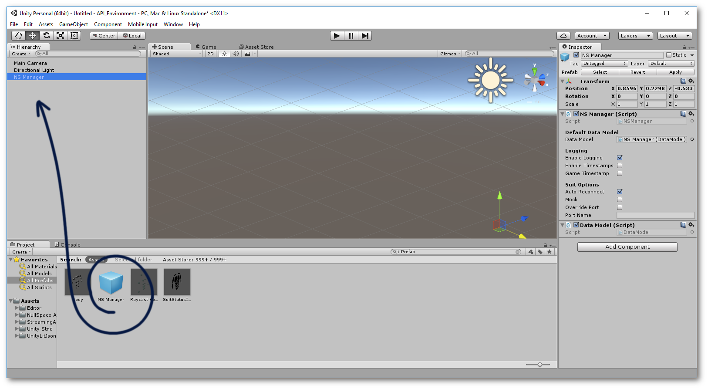
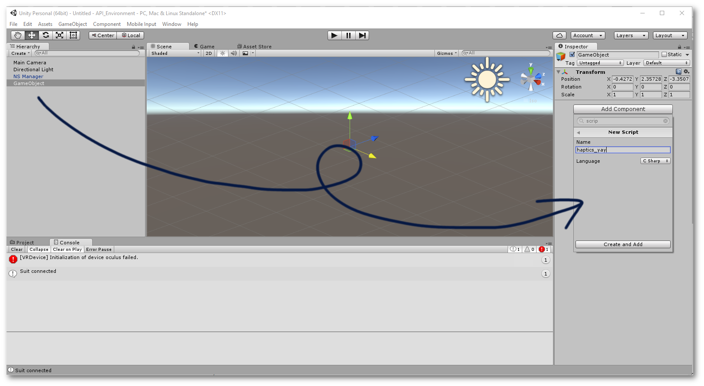
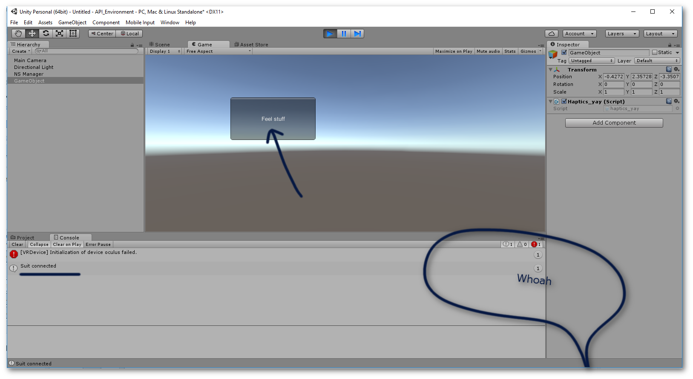

If you prefer text, go [here](#text-guide).

First, drag the `NSManager` prefab into the scene.


Second, create a new script for your haptics code, or integrate into an existing one.


Third, write some code to trigger the haptics.

```c#
using UnityEngine;
using NullSpace.SDK;

public class Haptics : MonoBehaviour {

    Sequence five_second_hum;
    void Start () {
        
        five_second_hum = new Sequence("ns.demos.five_second_hum");
	}
	
	void Update () {
	
	}

    void OnGUI()
    {
        if (GUI.Button(new Rect(200, 100, 200, 100), "Feel stuff"))
        {
            five_second_hum.CreateHandle(AreaFlag.All_Areas).Play();
        }
    }
}
```



For more, move on to [file-defined haptics](file-defined-haptics).


### Text guide
1. Drag the `NSManager` prefab into the scene. 
2. Create a new script, or use an existing one.
3. Bring the SDK into scope:
    ```c#
    using NullSpace.SDK;
    ```

4. Place something like the following into the `OnGUI()` function:
   ```c#
   if (GUI.Button(new Rect(20, 80, 120, 40), "Touch World!")) {
        new Sequence("ns.demos.five_second_hum").CreateHandle(AreaFlag.All_Areas).Play();
    }
   ```
This will immediately trigger a smooth hum for 5 seconds.

#### Further reading
- To move on to file-defined haptics, look [here](file-defined-haptics).