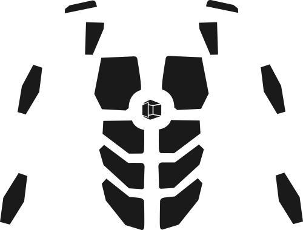

#### Area
An area on the suit refers to a set of physical feedback zones. Although there are 16 physical zones, there are more than 16 areas: for example, `Back_Both` refers to the two back zones, and `Left_All` refers to all zones on the left side of the body. Areas can be combined using bitwise operations, such as `Left_All | Right_All`, or `Chest_Left | Forearm_Left`.  

For more information on these processes, look at the [Area Flags](Area-Flags) page.

#### Effect
An effect is the smallest haptic building block that is available to you. A list of effects is available in the `NS Core/sequences` folder. Each effect can be modified with a strength level from `0.0` (weakest) to `1.0` (strongest). 

#### Sequence
A haptic sequence is a list of one or more effects. A sequence file is not location specific; it only cares about a collection of effects, their associated durations, and their time offsets. For instance, to define a "taptaptap" sequence, one might string together three click effects at one second intervals. Later, this sequence can be played on on any area and can be referred to by name in pattern files. 

#### Pattern
A haptic pattern is a list of one or more sequences, each bound to a specific area. Defined patterns can be further composed into full experiences, or played alone. 

#### Experience 
An experience is a collection of patterns with time offsets. Experience files are useful when you want to create a long, on-rails experience, or a short one composed of multiple patterns. 